# 바이브코딩 1일차

## VobeCoding with Codex/Cursor/Claude Code/Gemini

### AI에게 제대로 코딩을 시키자!

#### 1. 핵심 개념

코딩을 직접 작성하지 말것. AI와 협업해서 새로운 프로그램을 만들자.

#### Tip
문맥의 토큰을 어떻게 분리하는지 확인 사이트
- https://platform.openai.com/tokenizer
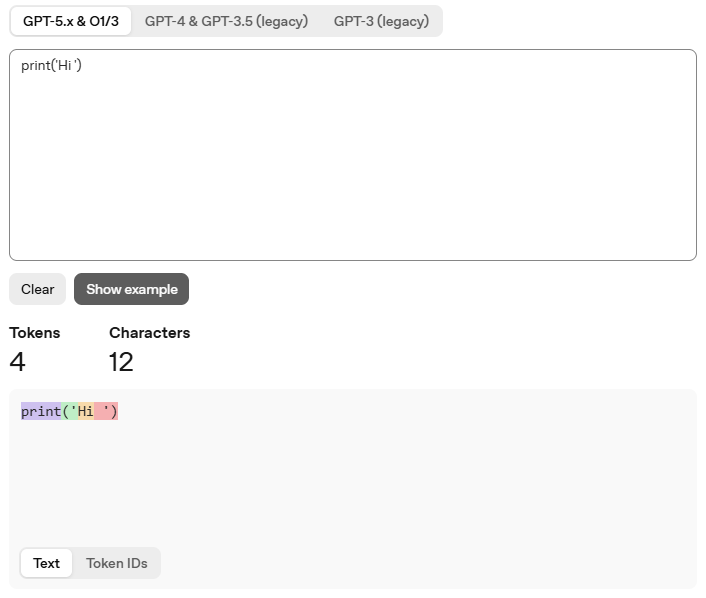


##### 1.1 기본 개발방식

요구사항 분석  > 설계(DB/UI 포함) > 구현 및 디버깅 > 테스트 > 배포 > 유지보수


##### 1.2 바이브코딩 방식

요구사항정의(PRD)/사람 > 코드생성/AI > 디버깅,테스트/AI > 검증 및 수정/사람 > 배포/사람 

##### 1.3 핵심 포인트

- AI - 시니어 개발자!
- 사람 - PM + 리뷰어

#### 2. 바이브코딩 개발 환경

여러방식 존재. 본인에게 맞는 방식을 찾으세요.

##### 2.1 CLI 코딩 방식

콘솔(터미널,파워쉘,bash)에서 바이브코딩 바이브코딩

- node.js 패키지 모듈 명령어(npm)로 설치
- https://nodejs.org/ko/download
- 버전 : node-v24.18.0-x64.msi

###### 2.1.1 ChatGPT - OpenAI Codex CLI
- 설치
```powershell
> npm install -g @openai/codex
```

-사용
```powershell
>codex
```
- 로그인 진행

-웹 브라우저 SSO로 진행
-폴더 신뢰 여부 확인 뒤
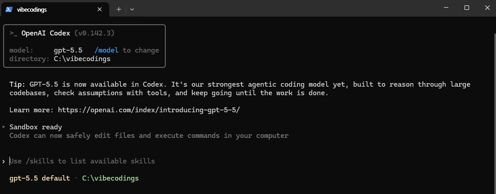

-개발화면

- 폴더 생성 명령 확인
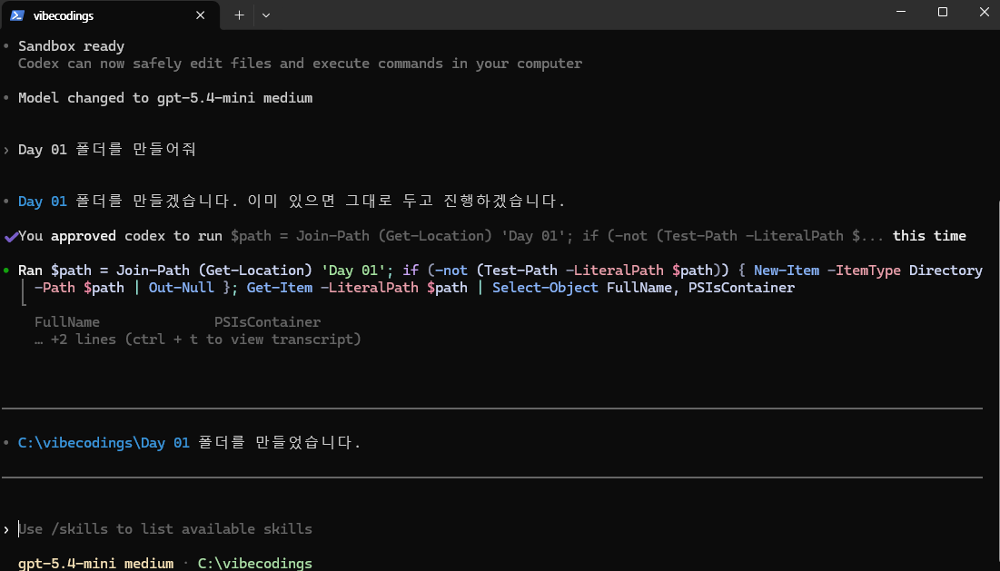

###### 2.1.2 Gemini CLI

```powershell
#설치
> npm install -g @google/gemini-cli

# 실행
> gemini


```
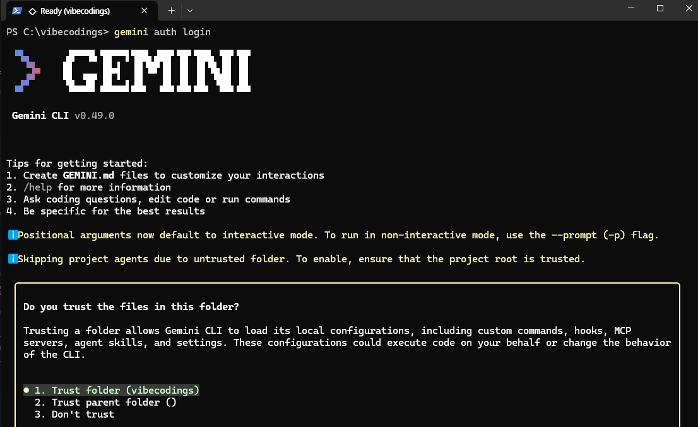


###### 2.1.3 ClaudeCode CLI
```powershell
# 설치
> npm install -g @anthropic-ai/claude-code

# 실행
> claude

```
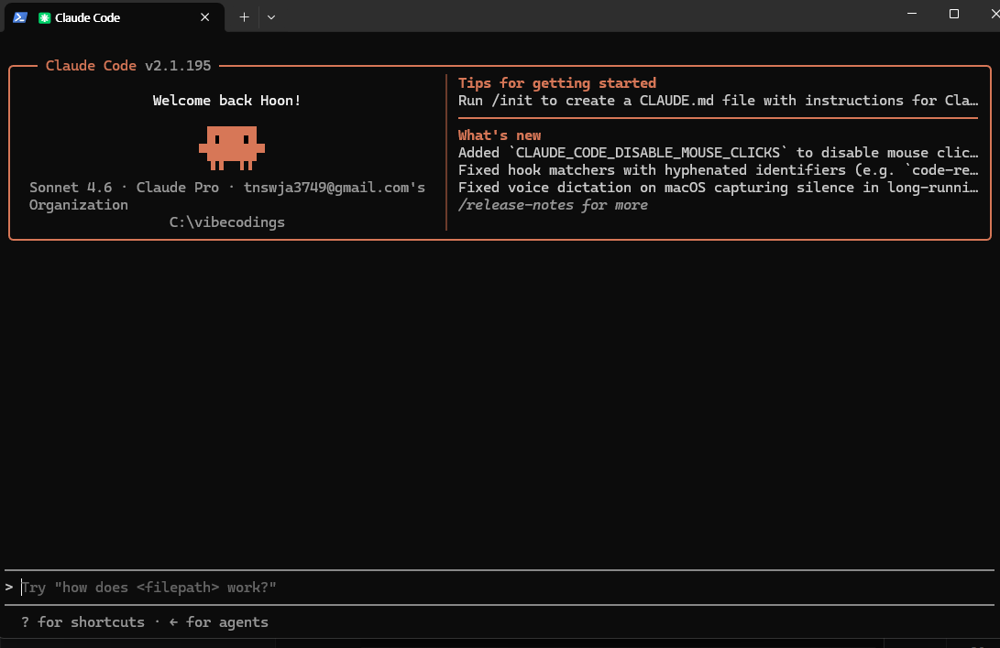


##### 2.2 웹브라우저 LLM 사용 방식

ChatGPT, 클로드, 제미나이 사이트 접속, 사용 바이브코딩

##### 2.3 IDE 툴 확장툴 사용 방식

VS Code (insider)의 확장 설치 바이브코딩

###### 2.3.1  Codex

- 확장 > Codex 검색 > OpenAI 버전 Codex 설치
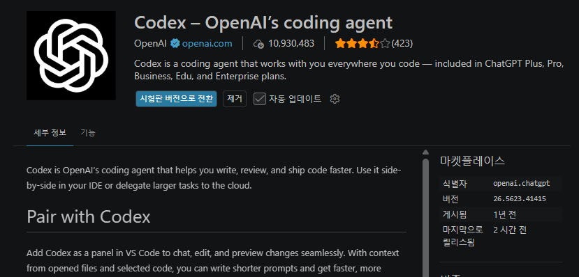
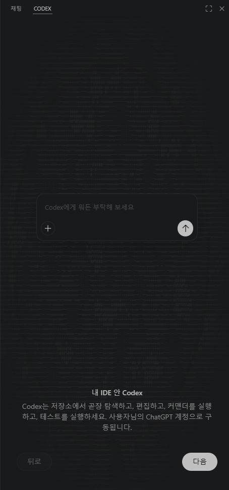
- 로그인

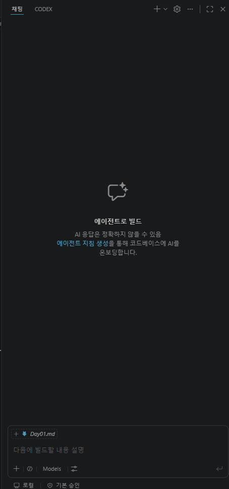

- Codex 실행화면


###### 2.3.2   Gemini Code Assist
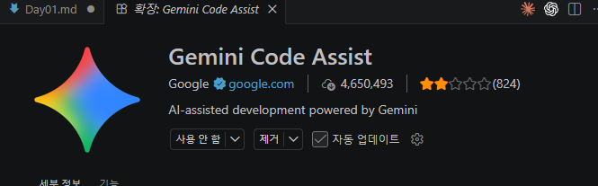
- 2026년 6월 18일부터 VS Code 확장 사용불가, Enterprise는 지원
- Antigravity 사용 권장
- ~~확장 > Gemini검색, Google 버전 Gemini Code Assist 설치
- ~~설치 후 채팅 앱
- ~~로그인


###### 2.3.3  Claude Code for VS Code
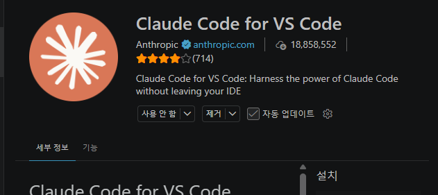
- Pro, Max 버전 이상 사용 가능
- 확장 > Claude 검색후, Anthropic 버전 설치
- 설치 후 채팅 앱
- 로그인


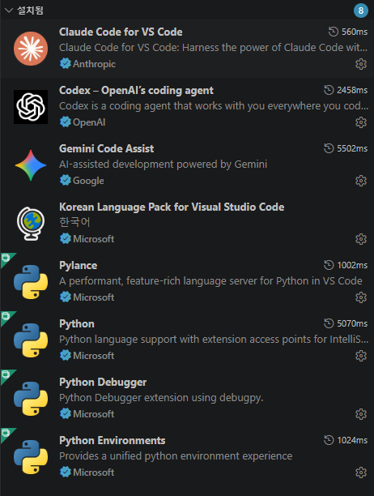

#### 3. 바이브코딩의 시작
##### 3.1 프롬프트 가이드
- LLM에 질문을 던지는 컨텍스트
- 간결한 프롬프트로 처리할 것
    - `주의를 살펴서 조심스럽게` , `자세히`, `조심스럽게...` 단어를 사용하지 말 것
    - `수정해줘`,`분석해줘`, `최적화해줘` 등 명령 형태로 문장을 완료할 것


##### 3.2 프롬프트 종류
- 제로샷 프롬프트 : 아무 예제없이 AI와 대화로 코딩을 시작하는 프롬프트 방식

- 원샷 프롬프트 : 예제 하나 정도 제공한 뒤 비슷한 작업을 수행하도록 요청하는 방식

- 퓨샷 프롬프트 : 2 ~ 5 개 예제를 제공한 뒤 작업 수행 요청

##### 3.3 ChatGPT, Gemini 웹 브라우저 바이브코딩
- 프롬프트는 명령이 아니고 설계도, 지시를 잘못하면 결과도 이상하게 나옴
```bash
# 나쁜 예
> 로그인을 만들어줘
> 뭔가 멋진 로그인을 만들어줘

# 좋은 예
>  로그인 기능을 만들어줘. Python으로

```

- 좀더 개선된 프롬프트 작성 필요

```bash
# 개선 1차 - 원 샷 프롬프트
>
너는 백앤드 개발자야.

사용자 로그인 기능을 만들어줘. Python FastApi 사용해줘.
```

- 더욱 개선된 퓨샷 프롬프트 작성
```bash
>
너는 백앤드 개발자야.

사용자 로그인 API를 만들어줘
- Python FastAPI 사용
- JWT 인증, OAuth 처리
- 예외처리 포함
```

###### 3.3.1 웹 브라우저 사용 바이브코딩 단점 

- 나온 결과를 직접 구성. 폴더, 파일 개발자가 수동으로 처리
- 디버깅이 개발툴과 웹브라우저 LLM 사이에 전환하면서 처리
- CLI나 IDE 툴 확장으로 좀 더 편하게 바이브코딩 하자

##### 3.4 Codex, API 사용 바이브코딩

- VS Code 등의  IDE툴 사용
- AI가 직접 폴더나 파일을 제어할 수 있음
- 디버깅도 실시간으로 가능, 배포도 AI가 해줄 수있음. 

###### 3.4.1 에이전틱 코딩 - TODO List

- HTML, Javascript, CSS를 사용한 간단한 TODO 리스트 프로그램
- 프롬프트 영역에 작성시 Shift + Enter로 여러줄 작성
```markdown
HTML,CSS,Javascript 사용해서 간단한  TODO 리스트를 만들어줘.

- 기능은 다음과 같아
- 할 일 추가
- 할 일 완료 체크
- 할 일 삭제
- 새로고침 전까지 브라우저에서 동작할 것
- 초보자가 이해하기 쉽게 작성
- 하나의 HTML 파일 CSS, Javascript 모두 추가할것
```
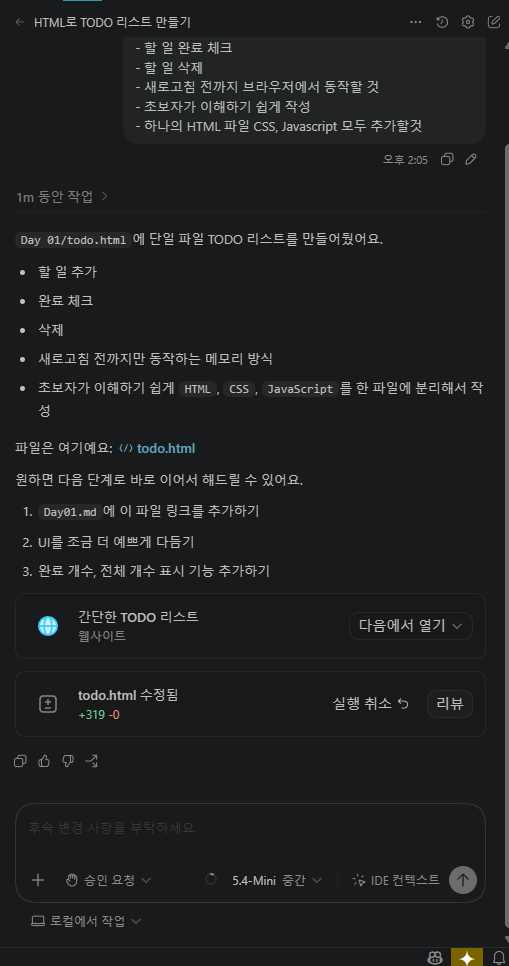

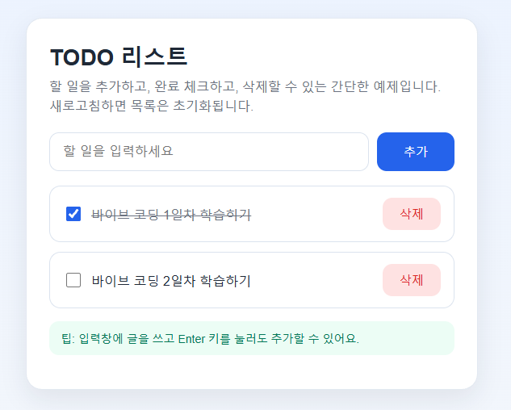
- 완성된 결과 화면
- 웹서버로 동작하는게 아님


```markdown
현재 사용중인 VS Code Insider에 Live Server 확장을 설치해줘
```
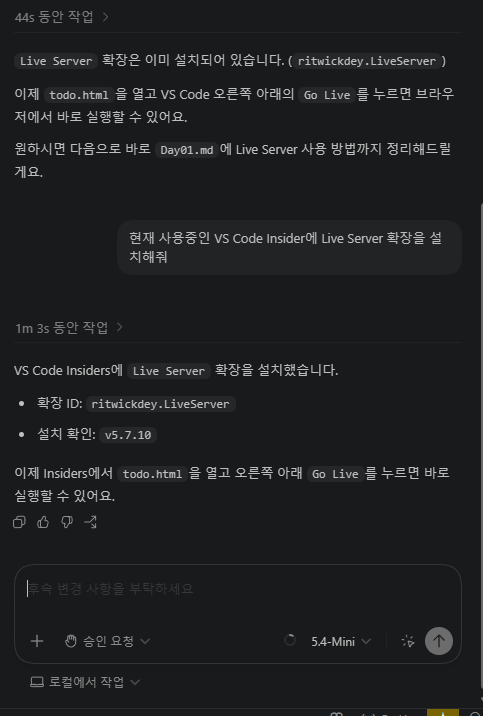

설치 완료

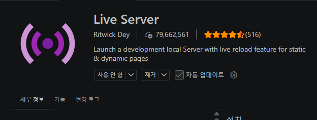

서버 실행명령
* 서버 실행 명령이 실패할수도 있습니다.
```markdown
Live Server로 조금전 작성한 index.html을 실행해줘
```
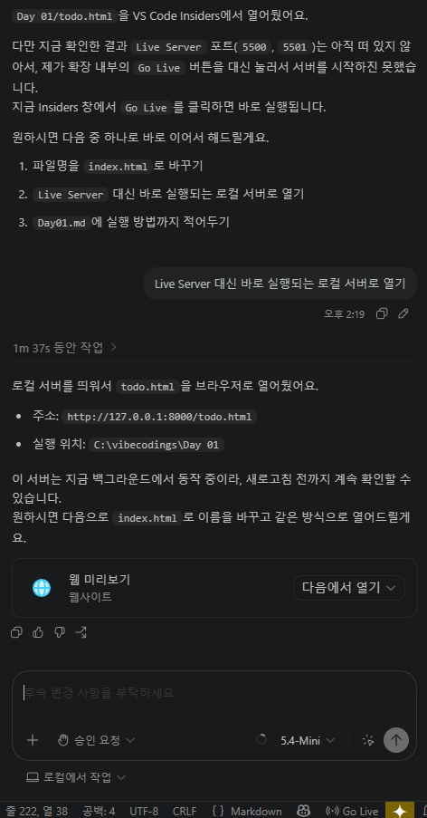

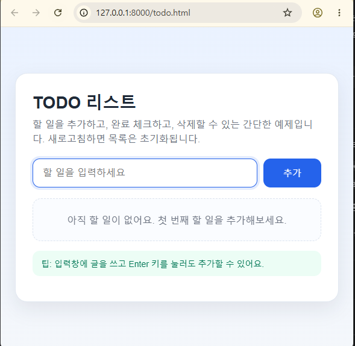

###### 3.4.2 TODO List 개선

- Python 웹서비스와 연계

- Python 가상환경  설치 및 실행
```powershell
# Python 가상환경 설치
> python -m venv venv
# Python 가상환경 활성화
> .\venv\Scripts\Activate.ps1
(Venv) >
```

```markdown
너는 백엔드 개발자야.

Python FastAPI로 간단한 TODO API를 만들어줘

요구사항
- 할 일 목록 조회
- 할 일 추가
- 할 일 완료 상태 변경
- 할 일 삭제
- 데이터는 메모리 리스트에 저장(DB사용 아님)
- 초보자도 이해하기 쉽게 작성
- 실행 방법도 같이 설명
```

###### 3.4.3 실제 FastAPI TODO API 예제

- 파일
  - `Day 01/main.py`
  - `Day 01/requirements.txt`
  - `Day 01/index.html`

- 실행 준비
```powershell
# 가상환경 활성화
.\venv\Scripts\Activate.ps1

# 패키지 설치
pip install -r "Day 01\requirements.txt"

# 서버 실행 방법 1: 폴더로 이동해서 실행
cd "Day 01"
uvicorn main:app --reload

# 서버 실행 방법 2: 현재 위치에서 app-dir 지정
uvicorn main:app --reload --app-dir "Day 01"
```

- 확인 주소
  - `http://127.0.0.1:8000`
  - `http://127.0.0.1:8000/docs`

- 프론트엔드 실행
  - `Day 01/index.html` 파일을 Live Server로 열기
  - 브라우저에서 `http://127.0.0.1:5500/index.html` 형태로 열림
  - 프론트엔드는 `http://127.0.0.1:8000` API를 호출함


#### 추가 실행

```markdown
간단한 HTML 프론트엔드 붙여서 브라우저에 CRUD 되게 만들어줘
```
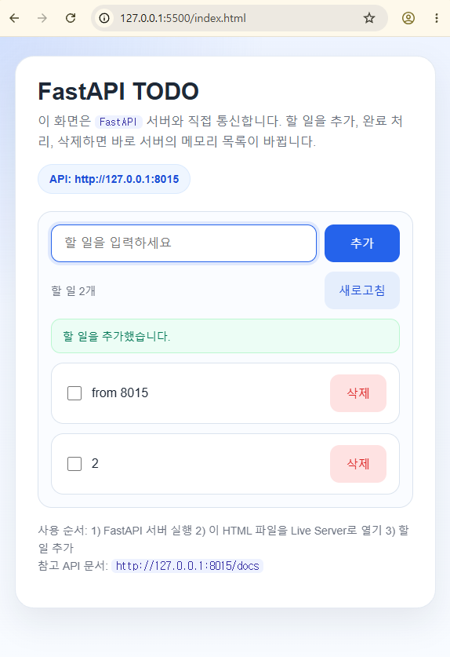
#### 다음 진행할 것

- 실제 DB 연동해서 데이터를 DB에 저장하는 기능 구현

#### 5. PRD.md
- Product Requirments Document의 약자. 제품 요구사항 정의서
- AI에게 던져줄 설계도
- 마크다운으로 작성. 필요한 경우는 이미지 포함


##### 5.1 퍼즐게임 PRD 예시
- PRD.md 로 저장
```markdown
## 프로젝트: 간단한 퍼즐 게임

### 목표:
- 브라우저에서 실행되는 퍼즐 게임

### 기능:
- 퍼즐 보드 표시
- 클릭 이벤트 처리
- 클리어 조건 판단

### 기술:
- HTML, CSS, JavaScript
- 하나의 index.html 파일

### 대상:
- 코딩 초보자
```

```markdown
Day01\puzzle_game아래에 PRD.md 파일 참조해서 만들어줘 UI는 ui.png 파일을 확인해서 만들면 돼.
```
##### 5.2 실행 결과 화면 
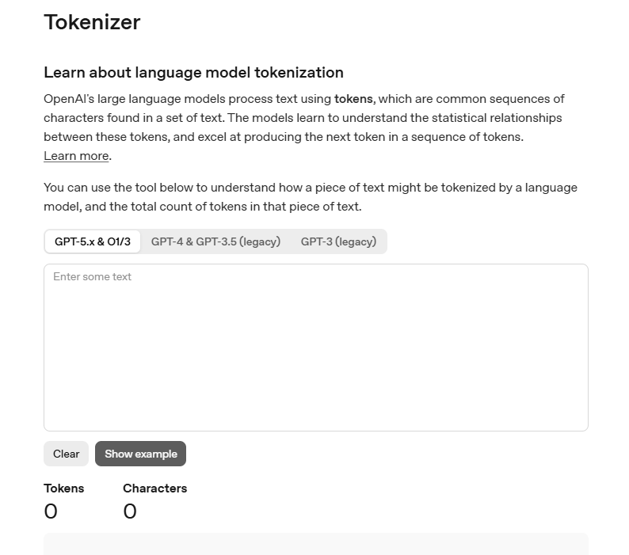

##### 5.3 분석
- AI가 생성한 코드를 분석
- 소스코드 > context menu > Add to Copdex Thread 선택 
- 소스 되돌리기 :  Ctrl + z 또는 실행취소 버튼
- 오류(예외) 발생하는 코드 영역을 선택, Codex Thread 등 전달 뒤 분석 요청

```markdown
이 코드만 한글 주석을 달아서 분석해줘
```
##### 5.4 분석 결과


##### 5.5 리펙토링

- 원본 소스를  분석, 좀 더 나은 로직으로 변경하는 것

```markdown
현재 index.html을 더 깔끔하게 리팩토링 해줘.

조건 : 
- 기능은 그대로 유지
- 함수 최대한 분리
- 변수명은 SnakeCasing으로
- 초보자도 이해 가능하게
- Js 스크립트에 주석 최대한 작성
- 변경 이유 설명

```
- 원본파일,탐색기 > context menu > `비교를 위해서 선택`
- 변경된 파일,탐색기 >  context menu > `선택한 항목과 비교`

##### 5.6 리펙토링 결과
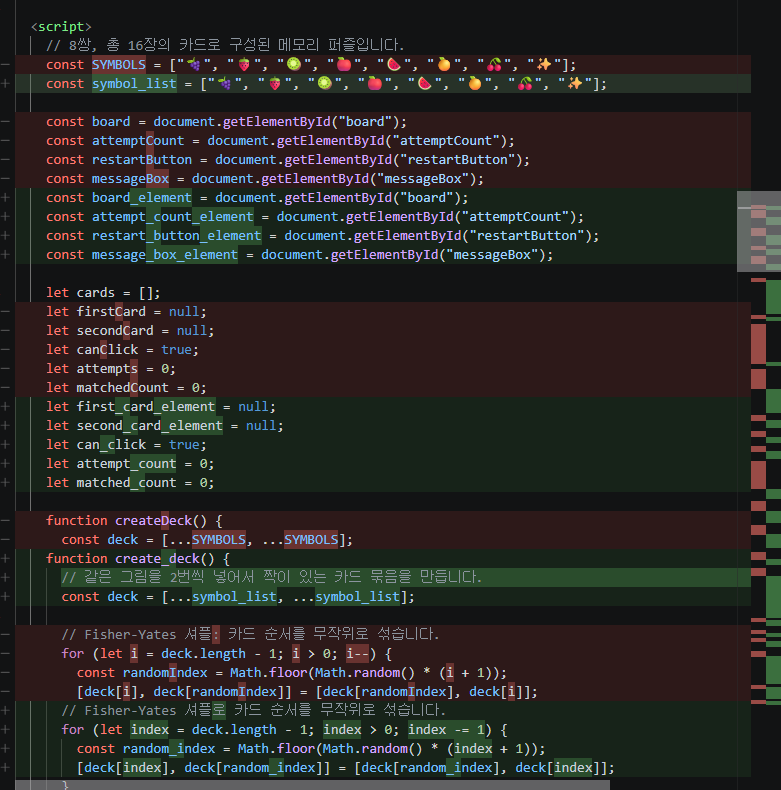


##### 5.7 예외처리 추가
- 실행 중 발생하는 오류
- 예외 발생하는 구문 Codex Thread로 전송 후 프롬프트 작성, 실행
```markdown
여기서 예외가 발생했어. 과일카드를 두 번 누르고 재빨리 다시 시작 버튼을 누르니깐, 이런 예외가 발생해.
확인 결과 hide_card()함수인데, 예외처리 구문을 추가해줘
```
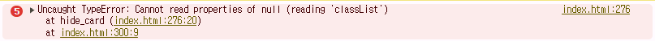
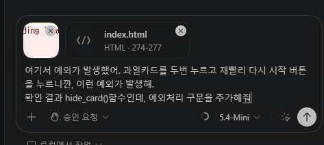

- 예외발생 처리결과
```js
    function hide_card(card_element) {
      // 맞지 않는 카드 두 장을 다시 뒤집는 역할입니다.
      // 재시작 직후처럼 카드가 없을 수도 있으니 먼저 확인합니다.
      if (!card_element) {
        return;
      }

      card_element.classList.remove("flipped");
    }

```

##### 5.8 구조 변경

- 예시

```markdown
현재 과일 이모지가 총 8개야. 갯수를 2배로 늘려서 랜덤하게 과일 이미지가 바뀌게 정리해줘
```
- 실행시 마다 과일 변경


##### 5.9 코드 설명 요청

- 예시
```markdown
Index.html 자바스크립트 코드를 초보자에게 설명하듯이 블록 단위로 설명해줘

- 외부라이브러리 확인
- 엔트리포인트 확인
- 실행 흐름
```
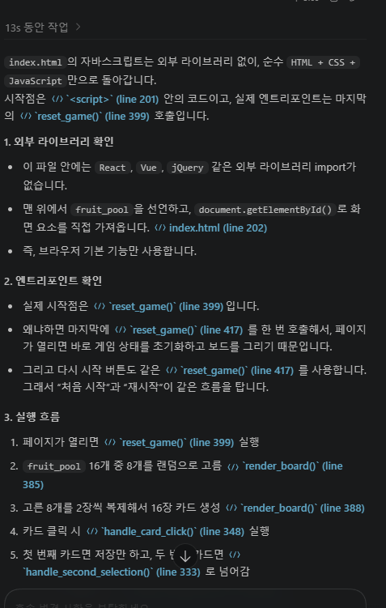