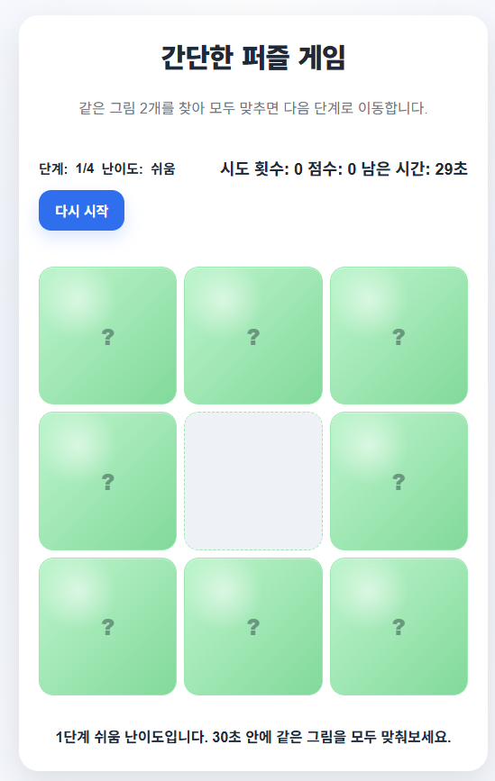
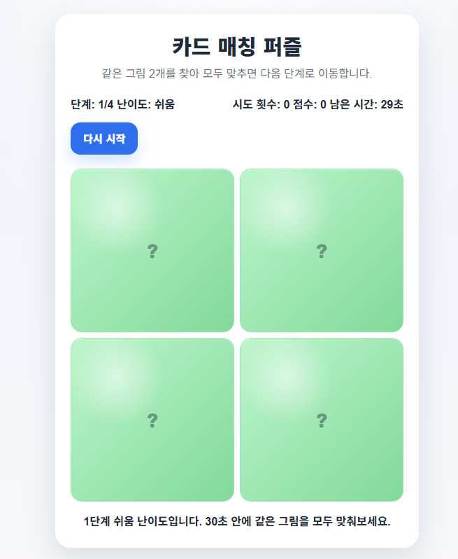
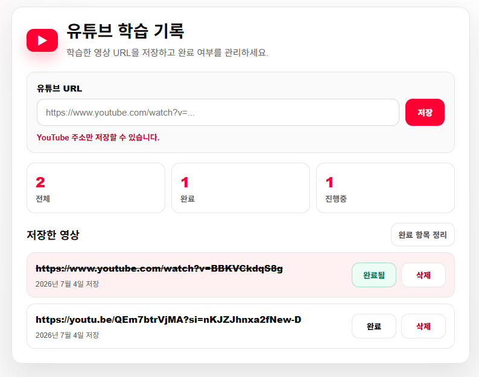
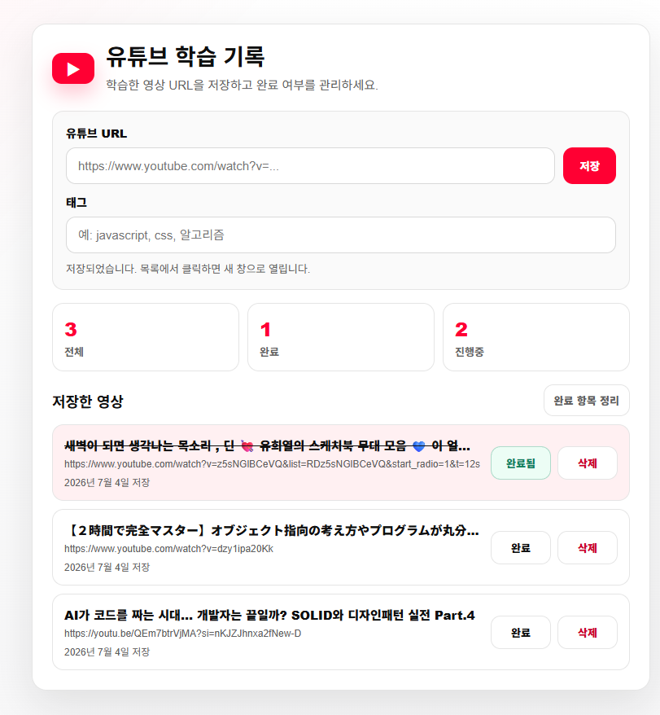
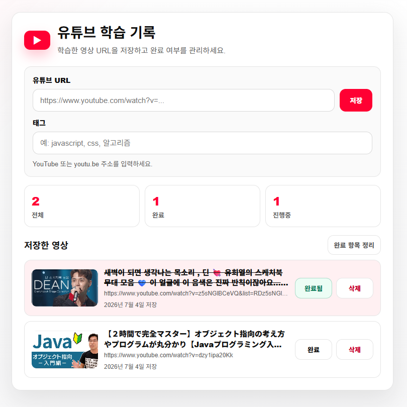
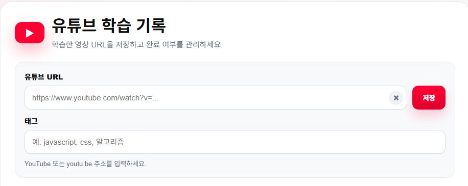
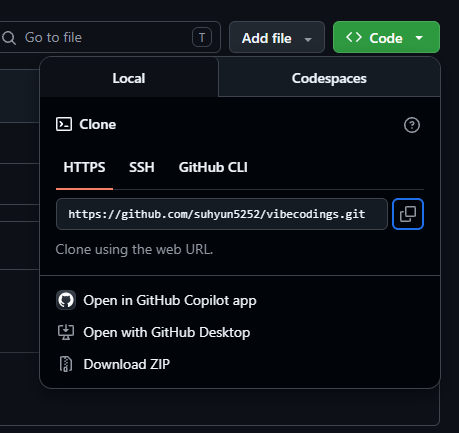

# 바이브코딩 2일차
## VideCoding with LLM

### AI에게 제대로 코딩 시키자2

#### 1. 퍼즐게임 기능 개선

- 난이도 조정, 타임아웃, 점수 개산...
- 게임 시작화면


- 난이도 -쉬움,중간,어려움


#### 2. PRD.md 개선
- 프롬프트로 진행한 개발 사항을 PRD.md 로 재작성 요청
- 필요한 경우 PRD.md를 수정


#### 3. 디버깅
- 프롬프트로 디버깅 요청
- 에러가 나면 추측하지 말고, 에러 전체를 AI에게 던져서 원인을 해결책을 찾으라 - 안드레아 카파시


#### 4. 실습


- 영상 제목 표시 및 태그 추가 

 
- 썸네일 표시 및 제목 두 줄 표시



- 유트브 URL 텍스트 삭제 버튼 추가



#### 5. 배포 

- 모바일 앱(플레이스토어,앱스토어) 논외
- 웹사이트 URL로 사용자에게 오픈할 수 있는 방법
- 웹서버 생성, URL 도메인 구매, 설정 ...

#### 5.1 Git 설치

- https://git-scm.com/
    - Install for Windows 버튼 설치판 다운로드
    - 설치 실행

#### 5.2 GitHub 가입
- https://github.com/?locale=ko-kr 가입후 NEW 버튼
    - `Repository Name` 은 필수
    - Visiblity - Public
    - `Readme` 추가 권장
    - `.gitlgnore` 개발하는 언어에 따라서 선택(거의 필수)

#### 5.3 GitHub 리포지토리 클론

- 내 컴퓨터에 복사
    - code 버튼 클릭 > clone > Https 주소 복사
    - https://github.com/suhyun5252/vibecodings.git
    

    - 윈도우 탐색기 경로 선택
        - Context 메뉴 > 터미널에서 열기 선택
```powershell
 > git clone https://github.com/suhyun5252/vibecodings.git .
```
- 이전 작업 폴더/파일을 복사한 깃허브 리포지토리 폴더로 이전

- Visual Studio Code에서 새폴더 열기

-이전 완료 화면

##### 5.4 GitHub Push(업로드)
- 푸시 : 로컬 저장소 파일을 리모트 저장소(Github)로 업로드 하는 작업

- 소스 제어 클릭
    - 변경 내용 아래 메시지 반드시 작성
    - 커밋(X) -> 드롭다운 버튼 클릭, 커밋 및 동기화 클릭


- Vercel 가입 및 등록

#### 6. 추가 내용


#### 7. 코딩테스트
- 마누스 ai
- 바이브코딩으로 프로그램 만들어보기 


